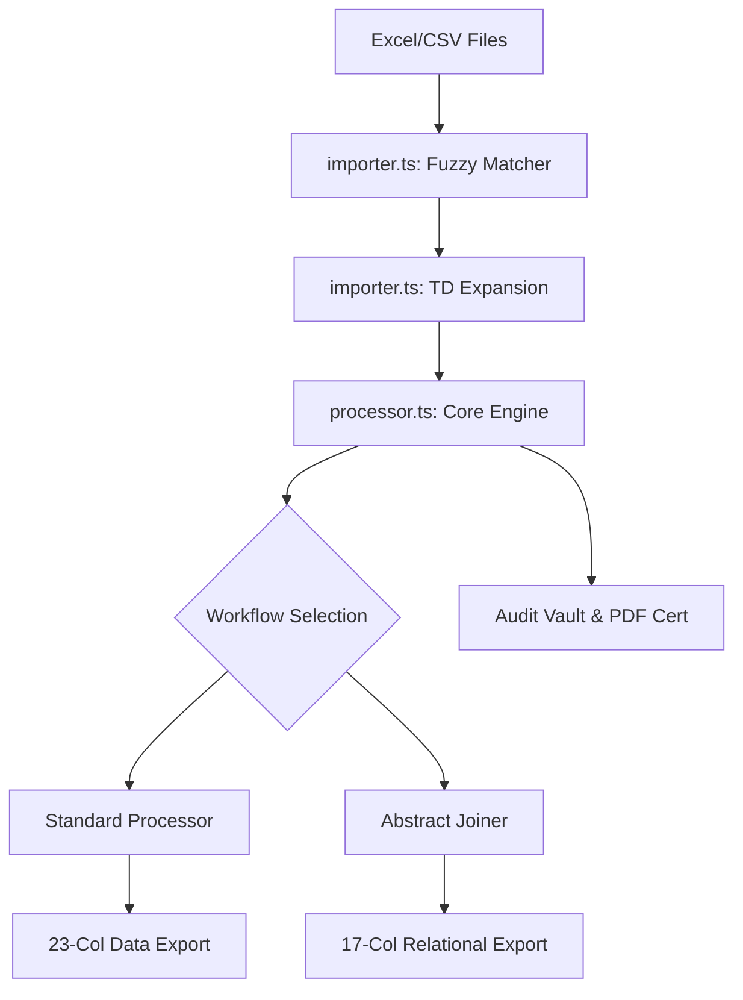

# DataLink Parañaque - Technical Documentation

## 1. Project Overview
*   **Project Name**: DataLink Parañaque
*   **Version**: 3.1.0
*   **Primary Objective**: To provide a specialized, high-performance web tool for the Real Property Data Division of Parañaque City to clean, validate, and join land record datasets.
*   **Problem Solved**: Manual data entry errors, complex multi-property Tax Declaration strings, and time-consuming relational joins between Journal logs and Assessment Rolls.

---

## 2. Features Documentation

### A. Data Ingestion (Smart Importer)
*   **Fuzzy Header Detection**: A registry of over 100 aliases (found in `importer.ts`) allows the engine to recognize columns regardless of naming variations (e.g., `Tax Dec`, `ARP`, `TD No`).
*   **Multi-File Staging**: Users can drop multiple files simultaneously. Files are queued and processed sequentially to maintain performance.
*   **TD Expansion Algorithm**: 
    *   Detects patterns like `E-003-52121/22/23`.
    *   Splits the string and reconstructs the full PIN/ARP for each property.
    *   Preserves the relationship so that "Selling Price" is only attributed to the primary record.

### B. Standard Processor Workflow
*   **System Cleanup**: Identifies and removes "Noise Rows" (Total rows, Page headers, Empty lines).
*   **Deduplication**: Normalizes PINs and keeps only the record with the highest numeric ARP value (prioritizing the latest update).
*   **Calibration**: Automatically maps Barangay names and Section locations based on the internal `locations` JSON database.

### C. Abstract of Transactions Workflow (Relational Joiner)
*   **Three-Way Join Logic**:
    1.  **Journal** (Transaction Log) acts as the primary driver.
    2.  **Assessment Roll** provides the "Transfer From" owner details and parcel specifics (Lot #, TCT #).
    3.  **Sales Data** provides the "Amount of Consideration" (Selling Price).
*   **Ref Reference**: Implements `REF: [TD]` labels in exported files for linked properties to ensure fiscal totals aren't inflated by duplicate prices.

### D. Analytics & Audit
*   **Diagnostic Visualization**: Real-time charts for AU Distribution, Geographic Hotspots, and Join Success Rates.
*   **Audit Vault**: Saves metadata of every run. Generates a signed **PDF Audit Certificate** summarizing the processing metrics.

---

## 3. System Architecture

### Frontend Architecture
*   **Framework**: Next.js 15 (Client-side rendering for data privacy).
*   **State Management**: React `useState` and `useMemo` for high-frequency data updates. Context API used for cross-modal notifications.

### Data Flow Diagram

---

## 4. Technical Stack

| Technology | Version | Purpose |
| :--- | :--- | :--- |
| **Next.js** | 15.5.9 | Full-stack framework (used for UI and routing) |
| **React** | 19.0.0 | Component-based UI library |
| **Tailwind CSS** | 3.4.1 | Utility-first styling |
| **XLSX (SheetJS)**| 0.18.5 | High-performance spreadsheet parsing and generation |
| **jsPDF** | 2.5.2 | Generation of Audit Certificates |
| **Recharts** | 2.15.1 | Diagnostic analytics visualization |
| **Lucide React** | 0.475.0| Professional iconography |

---

## 5. Security & Privacy Documentation
*   **Offline-First**: The application logic resides entirely in the client browser. No parcel data, owner names, or financial values are transmitted to any server.
*   **Memory Residency**: Property records are kept in volatile JavaScript memory. Closing the browser tab purges the active data session.
*   **Persistence**: Only non-sensitive metadata (file counts, timestamps) and configuration settings (unit values) are stored in `LocalStorage`.

---

## 6. Component Documentation

### `ImportZone`
*   **Purpose**: Handle Drag-and-Drop and File Selection.
*   **Key Logic**: Manages a queue of `File` objects and triggers `parseFile` utility.
*   **Props**: `onDataImported`, `mode` (Raw, Journal, Sales).

### `DataPreviewTable`
*   **Purpose**: Optimized rendering of large datasets (up to 20,000+ rows).
*   **Key Logic**: Implements batch loading (350 rows at a time) to prevent DOM bottleneck and browser hangs.
*   **Props**: `data`, `isProcessed`, `workflowMode`.

---

## 7. Future Improvements
1.  **WebWorkers Implementation**: Move the `processRecords` logic to a background thread to keep the UI 100% responsive during massive file joins.
2.  **Template Creator**: Allow users to define custom "Target Export Templates" beyond the Standard/Abstract formats.
3.  **OCR Integration**: Add capability to process scanned PDF assessment rolls using client-side Tesseract.js.

---
*Document prepared by: DataLink Technical Engineering Team.*
